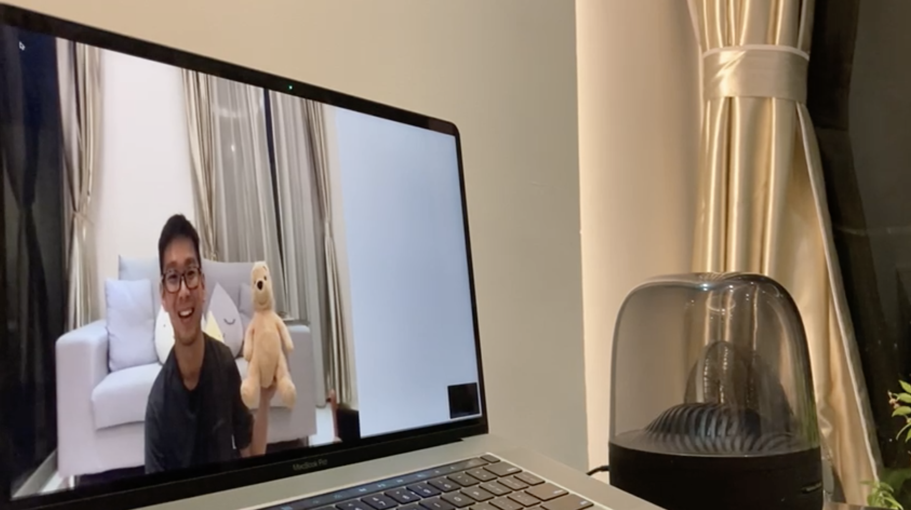

# cv-magic-trick

A simple weekend project, using Semantics Segmentation to make the class "Human" disappears, while everything remains.

## Method
From the output of Deeplabv3 semantics segmentation algorithm, we find the location of "class 15 - People", and convert them to the background pixels that we take before hand in `img/` folder, and output it onto webcam stream. 

## Instructions
- Clone this repo `https://github.com/mylee16/cv-magic-trick.git`
- `cd cv-magic-trick` 
- `pip install -r requirements.txt` to install the required packages
- `git clone https://github.com/bonlime/keras-deeplab-v3-plus.git` to clone deeplab v3 code base
- Update line 170 on keras-deeplab-v3-plus/model.py to `in_channels = inputs.shape[-1]` (a small bug on the deeplab v3 repo)
- Rename the folder `keras-deeplab-v3-plus` to just `deeplab`
- Then, take a photo of your background, and name it background.jpg and put it in img/ folder
- Run `python -m main`
- Press "t" on your keyboard to toggle between invisibility! 
- Have fun!

<a href="https://youtu.be/Toqxrv1S-qo" title="Magic Trick with Computer Vision">
  

    
  

</a>

## Acknoledgement
Deeplabv3 codebase: https://github.com/bonlime/keras-deeplab-v3-plus
OpenCV Tutorial: https://www.freecodecamp.org/news/how-to-use-opencv-and-python-for-computer-vision-and-ai/